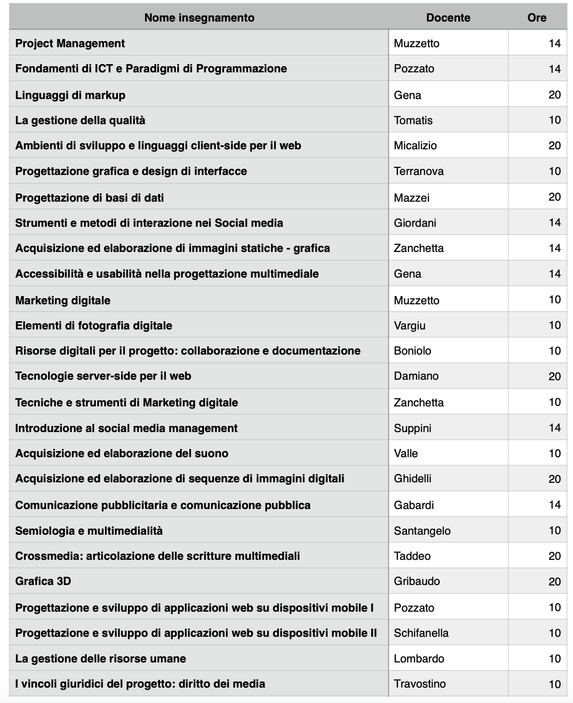

# ASP

## Progetto
L'obbiettivo del progetto è la generazione del calendario, utilizzano il paradigma ASP (Answer Set Programming), del “Master in Progettazione e Management del Multimedia per la Comunicazione” dell’Università di Torino che, con la sua storia iniziata nel 1996, è il più  longevo d’Europa. Le lezioni del master si svolgono il venerdì (8 ore) e il sabato (4 o 5 ore) nell’unica aula assegnata al Master, per 24 settimane. Inoltre, sono previste due settimane full-time, la 7a e la 16a, con lezioni dal lunedì al sabato (8 ore al giorno da lunedì a venerdì, 4 o 5 ore al sabato).
Il calendario dovrà tener conto dei seguenti vincoli, da considerarsi partizionati in rigidi (da soddisfare tassativamente) e auspicabili (da soddisfare ove possibile, e nel maggior numero possibile). Gli
insegnamenti da collocare sono i seguenti, accompagnati dal docente titolare e dal numero di ore da svolgere:

  

I vincoli rigidi sono i seguenti:
- lo stesso docente non può svolgere più di 4 ore di lezione in un giorno
-  a ciascun insegnamento vengono assegnate minimo 2 e massimo 4 ore nello stesso giorno
-  il primo giorno di lezione prevede che, nelle prime due ore, vi sia la presentazione del master
-  il calendario deve prevedere almeno 2 blocchi liberi di 2 ore ciascuno per eventuali recuperi di lezioni annullate o inviate
- l’insegnamento “Project Management” deve concludersi non oltre la prima settimana full-time
- la prima lezione dell’insegnamento “Accessibilità e usabilità nella progettazione multimediale” deve essere collocata prima che siano terminate le lezioni dell’insegnamento “Linguaggi di markup”
- le lezioni dei vari insegnamenti devono rispettare le seguenti propedeuticità, in particolare la prima lezione dell’insegnamento della colonna di destra deve essere successiva all’ultima lezione del corrispondente insegnamento della colonna di destra:

  

I vincoli auspicabili sono i seguenti:
- la distanza tra la prima e l’ultima lezione di ciascun insegnamento non deve superare le 6 settimane
- la prima lezione degli insegnamenti “Crossmedia: articolazione delle scritture multimediali” e “Introduzione al social media management” devono essere collocate nella seconda settimana full-time
- le lezioni dei vari insegnamenti devono rispettare le seguenti propedeuticità, in particolare la prima lezione dell’insegnamento della colonna di destra deve essere successiva alle prime 4 ore di lezione del corrispondente insegnamento della colonna di sinistra:

  

Oltre all’implementazione degli esercizi è necessario predisporre una relazione che contenga la descrizione delle implementazioni realizzate, mettendo in evidenza le scelte di progetto più significative. Si richiede anche di descrivere le prove che sono state fatte, e gli aspetti positivi e negativi delle tecniche utilizzate, oltre ad una analisi dei risultati sperimentali ottenuti.
